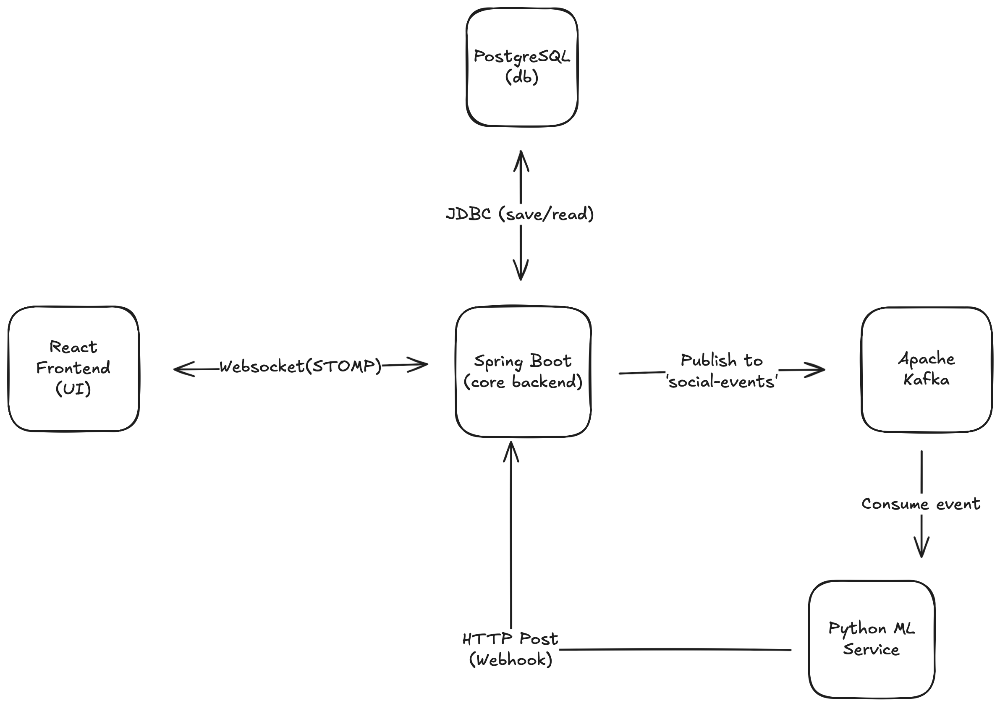

# SocialGym 🧠💬

An event-driven, AI-powered conversational simulator built with a polyglot microservices architecture. 

SocialGym provides a real-time chat interface where users can practice social scenarios (like debate, dating, or networking) with an AI agent. Behind the scenes, a decoupled machine learning pipeline performs real-time Natural Language Processing (NLP) sentiment analysis on the conversation without blocking the main application thread.

### 🎥 Live Demo


## 🏗️ System Architecture



1. **Real-Time UI:** The React frontend maintains a full-duplex **WebSocket (STOMP)** connection with the Spring Boot backend, ensuring sub-millisecond chat latency.
2. **Core Backend:** **Spring Boot** handles business logic, saves raw messages to **PostgreSQL**, and acts as a message producer.
3. **Event Streaming:** Instead of synchronous blocking API calls, Spring Boot publishes chat events to an **Apache Kafka** cluster.
4. **Asynchronous ML:** A dedicated **Python** microservice consumes events from Kafka, runs a Hugging Face / PyTorch sentiment analysis model, and updates the database via a REST Webhook. 
5. **Smart Upserts:** The backend broadcasts the ML-enriched data back over the WebSocket, and the React UI dynamically updates existing messages in-place without requiring a page refresh.

## 🚀 Tech Stack

* **Frontend:** React, TypeScript, Tailwind CSS, Recharts, SockJS/STOMP
* **Backend:** Java, Spring Boot, Spring Data JPA, Spring WebSockets
* **ML Microservice:** Python 3, PyTorch, Hugging Face Transformers
* **Infrastructure:** PostgreSQL, Apache Kafka (KRaft mode), Docker & Docker Compose

## 🛠️ Quick Start (Local Deployment)

This entire 5-tier architecture is fully containerized. You can spin up the UI, Backend, Database, Message Broker, and ML Engine with a single command.

### 1. Set up Environment Variables
Duplicate the provided `.env.example` file, rename it to `.env`, and insert your OpenAI API key:
```bash
cp .env.example .env
```

### 2. Launch the Cluster

Ensure the Docker daemon is running on your machine, then execute:

```bash
docker-compose up --build -d
```
### 3. Access the Application

Frontend UI: `http://localhost`

Backend API: `http://localhost:8080`

Note: The initial startup will take a few minutes as Docker resolves base images, Maven dependencies, and downloads the PyTorch NLP models.

### 🛑 Teardown
To spin down the cluster and wipe the database volumes, run:

```Bash
docker-compose down -v
```

### 📁 Project Structure
`/frontend` - React application, WebSocket subscription logic, and UI components.

`/backend` - Spring Boot server, JDBC JPA entities, and Kafka Producer configurations.

`/ml-service` - Python consumer daemon, Hugging Face pipeline, and HTTP webhook caller.

`docker-compose.yml` - Infrastructure orchestration mapping ports, networks, and environment variables.